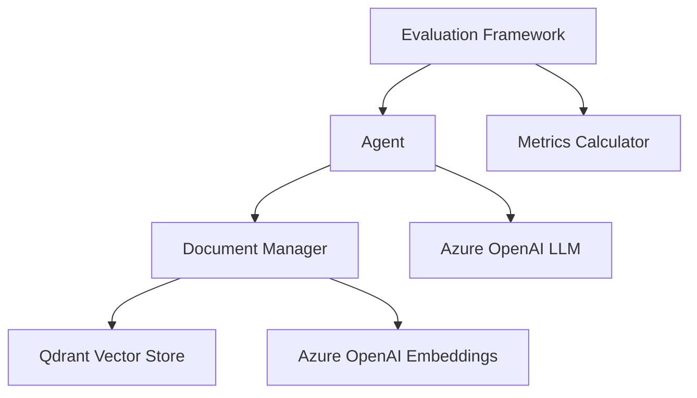

# RAG Pipeline Backend System

A comprehensive backend system implementing Option 2 (RAG Pipeline) with a strong emphasis on evaluation framework. The system processes PDF documents, analyzes their content, and returns relevant data with proper citations.

## Core Components

### 1. Backend Agent
- PDF file upload and processing capabilities
- Content analysis and chunking
- Relevant data extraction with citations
- Simple REST API endpoints

### 2. Evaluation Framework
The evaluation framework is the primary focus of this system, featuring:

#### Evaluation Dataset
- 100 data points for comprehensive testing
- Sample PDFs with associated queries
- Expected outputs and ground truth data
- Focus on financial information processing

#### Automated Evaluation Script
Measures key metrics:
- **Accuracy**: Correctness of returned information
- **Relevance**: Query-result appropriateness
- **Citation Quality**: Source reference accuracy
- **Performance**: Processing response times

## Architecture

### Core Components Interaction



### Key Components

#### 1. Agent (`agent.js`)
The agent serves as the primary interface for handling queries and generating responses:
- Implements a tool-based architecture using the AI SDK
- `searchKnowledgeBase` tool for retrieving relevant information
- Integrates with Azure OpenAI for text generation
- Maintains context and manages conversation flow
- Returns responses with proper citations and metadata

#### 2. Document Manager (`embeddings.js`)
Handles all vector operations and document processing:
- Text chunking using RecursiveCharacterTextSplitter (1000 tokens, 200 overlap)
- Embedding generation via Azure OpenAI
- Vector storage and retrieval through Qdrant
- Document metadata management
- Query processing and semantic search

#### 3. Evaluation Framework (`run-evals.js`)
Comprehensive testing and metrics calculation system:
- Automated test execution against 100+ test cases
- Metrics calculation:
  - Accuracy: Semantic similarity with expected results
  - Relevance: Context-appropriate response measurement
  - Citation Quality: Source attribution verification
  - Performance: Response time tracking
- Category-based result aggregation
- Detailed error logging and analysis

### Data Flow

1. **Document Ingestion**
   ```
   PDF → Text Extraction → Chunking → Embedding Generation → Vector Storage
   ```

2. **Query Processing**
   ```
   Query → Embedding → Vector Search → Context Retrieval → LLM Response
   ```

3. **Evaluation Pipeline**
   ```
   Test Case → Agent Processing → Metric Calculation → Results Aggregation
   ```

### Integration Points

- **Azure OpenAI**: Text embeddings and LLM capabilities
- **Qdrant**: Vector storage and similarity search
- **LangChain**: Text splitting and processing utilities
- **Zod**: Runtime type checking and validation

## Technical Implementation

### Prerequisites

- Node.js (v16 or higher)
- NPM (v8 or higher)
- Azure OpenAI API access
- Qdrant (vector storage)

### Installation

1. Clone the repository:
```bash
git clone [your-repository-url]
cd rag-pipeline
```

2. Install dependencies:
```bash
npm install
```

3. Configure environment variables in `.env`:
```env
PORT=3000
AZURE_OPENAI_API_KEY=your-api-key
AZURE_OPENAI_API_INSTANCE_NAME=your-instance-name
AZURE_OPENAI_API_DEPLOYMENT_NAME=your-deployment-name
```

### Usage

#### Running the Backend Agent

Development mode:
```bash
npm run dev
```

Production mode:
```bash
npm start
```

#### Document Processing

Upload and process new documents:
```bash
npm run ingest -- --file=path/to/your/document.pdf
```

#### Running Evaluations

1. Prepare evaluation data:
```bash
cp your-test-pdfs/ src/evaluation/dataset/pdfs/
```

2. Execute evaluation suite:
```bash
npm run eval
```

3. View evaluation results:
```bash
cat evaluation-results.json
```

## API Endpoints

### PDF Upload
- **POST** `/upload`
  - Accepts PDF files via multipart/form-data
  - Returns document ID and processing status
  ```bash
  curl -X POST -F "file=@document.pdf" http://localhost:3000/upload
  ```

### Query Document
- **POST** `/query`
  - Accepts natural language queries
  - Returns relevant information with citations
  ```bash
  curl -X POST -H "Content-Type: application/json" \
       -d '{"query":"What are the financial highlights?"}' \
       http://localhost:3000/query
  ```

## Project Structure

```
.
├── src/
│   ├── index.js              # Server entry point
│   ├── embeddings.js         # Embedding generation
│   ├── ingestDoc.js          # Document processing
│   └── evaluation/           # Evaluation framework
│       ├── dataset/          # Test data (100+ samples)
│       └── run-evals.js      # Automated evaluation
├── uploads/                  # Document storage
└── package.json             # Dependencies
```

## Technology Stack

- **Backend Framework**: Express.js
- **PDF Processing**: pdf-parse, pdf-lib
- **Vector Storage**: Qdrant
- **Embeddings**: Azure OpenAI
- **Text Processing**: LangChain
- **Testing**: Custom evaluation framework

## Evaluation Metrics Details

### 1. Accuracy (0-1)
- Ground truth comparison
- Factual correctness verification
- Content extraction accuracy

### 2. Relevance (0-1)
- Query-response alignment
- Context appropriateness
- Information completeness

### 3. Citation Quality (0-1)
- Source attribution accuracy
- Reference completeness
- Context preservation

### 4. Performance
- Response latency
- Processing throughput
- Resource efficiency

